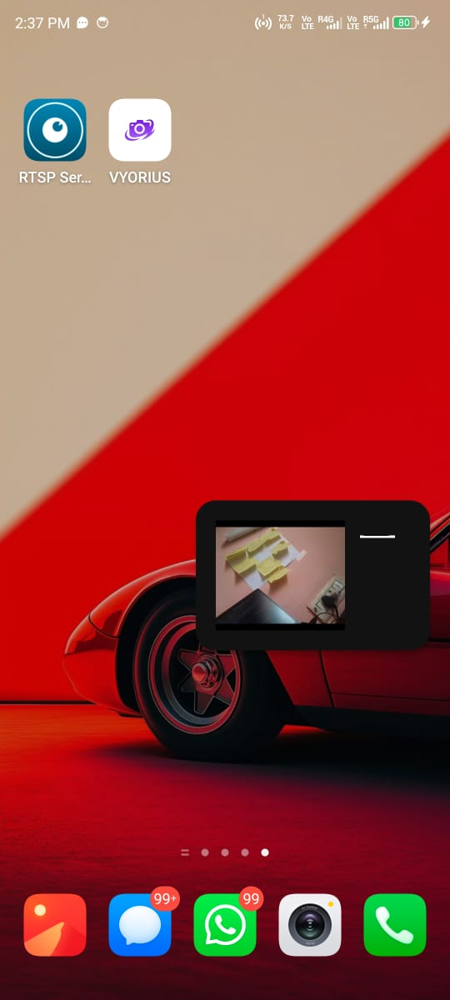
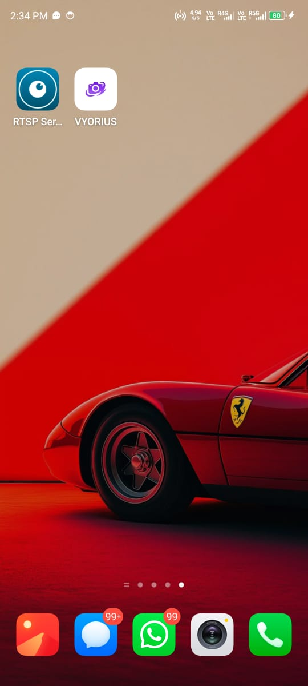
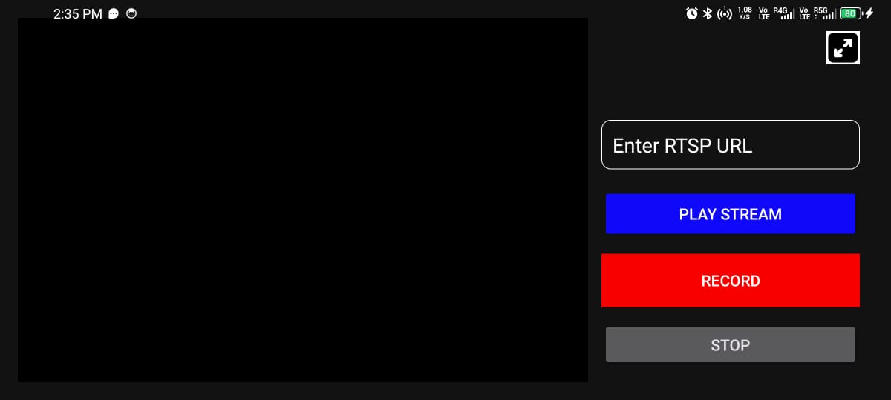
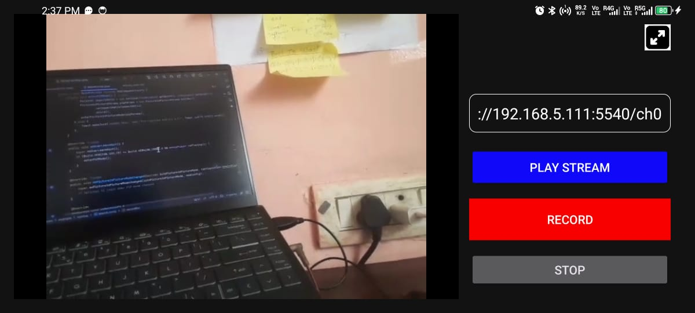

# 📺 RTSP Streaming App

Vyorius is an Android application that allows users to stream RTSP video using the VLC media player library. It also supports Picture-in-Picture (PiP) mode for multitasking while watching live streams. The app offers a simple UI and smooth streaming experience.

---

## ✨ Features

- 🔗 Stream RTSP video from a custom URL
- 🛑 Stop stream at any time
- 🖼️ Picture-in-Picture (PiP) mode support
- ⚡ Lightweight and responsive UI

---

## 📸 Screenshots

<p float="left">
  
  
  
  
</p>


---

## 🚀 Getting Started

### Prerequisites

- Android Studio (latest version recommended)
- Android SDK 26 or above
- Android device or emulator running Android 8.0 (API 26) or later


  ---

## 🧰 Libraries and Protocols Used

### 📦 VLC for Android (LibVLC)
The app uses **LibVLC** — the core of the popular VLC media player — to handle RTSP streaming.

- Supports a wide variety of protocols and codecs  
- Provides reliable media playback, hardware acceleration, and customizable caching  

### 🔗 RTSP (Real-Time Streaming Protocol)
**RTSP** is a network control protocol designed for use in entertainment and communications systems to control streaming media servers.

- Used in this app to access and stream live camera feeds or other real-time video sources  

### 🖼️ Picture-in-Picture (PiP)
Android's **Picture-in-Picture (PiP)** API is used to allow users to continue watching the stream in a floating window while multitasking.

---

## 🙌 Acknowledgements

- [VLC Android SDK](https://code.videolan.org/videolan/libvlc-android)
- [Android FFmpeg Kit](https://github.com/arthenica/ffmpeg-kit) *(not used in current version)*
- RTSP streaming resources and testing tools

---


### How to Build and Run

```bash
git clone https://github.com/Prashid2002/vyorius-rtsp-app.git
cd vyorius-rtsp-app


